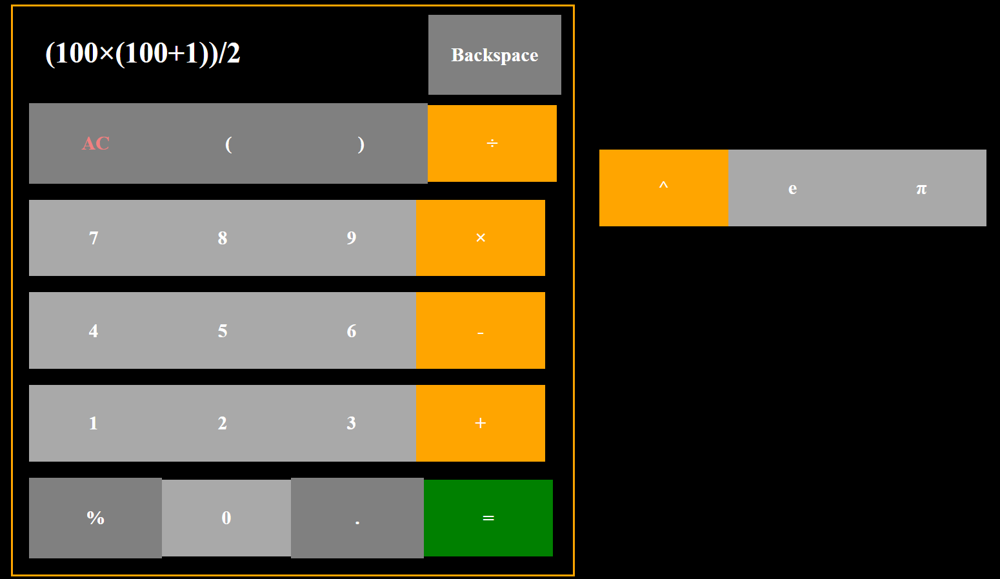

# Mehul's Calculator


## Description
A simple calculator that supports basic operations, completed as part of The Odin Project.

Technologies used: HTML, CSS, Javascript
### Website: https://mehul-gandhi.github.io/calculator/

### Features
* Keyboard support and interactive buttons
* Multiplication, Division, Addition, Subtraction
* Decimals, Percentages, 
* Power  operator
* The numbers e and π
* Paranthesis (recursively evaluates an expression)
* Backspace and Clear Entry


### Challenges Faced
Math uses GEMDAS as their way of evaluating expressions. The order of operations is as follows: evaluate grouping expressions (paranthesis), exponentation, multiplication, division, addition, and subtraction. 

The hardest challenge faced was developing the proper algorithm to simplify a string that contains user input to the correct number using GEMDAS. I used leetcode to help develop the algorithm, but modified the algorithm to work with the numbers e and π as well as decimals and percentages. I came up with an algorithm to add the mantissa part of a floating number to the entire number from an expression string.

User input validation was another tough challenge.  There cannot be more than 25 characters on the string due to space limitations. Only one operator can be used at a time, meaning ```3 +* 2``` is not a valid expression. If the number of open paranthesis is greater than the number of closed paranthesis, I add closed paranthesis to the end of the expression string before evaluating the expression string. I have listed examples of valid expressions and invalid expressions below.

#### Examples of Valid Expressions:
* ``` 3 + 2```
* ``` 12.45 + 6.99 * (5/2 - 10) ```
* ``` 6.7 - (6 * 3 + ( 9 * (7 * 9/7 ) ) + 8.4)```
* ``` e^9 + π/2```
* ``` -5 + 6% ```
* ``` 1.7 + (3 ```

#### Examples of Invalid Expressions:
* ``` 3 +* 2```
* ``` (9 + 2 * 5))```
* ``` e.2```
* ``` 1 / 0```
* ``` 9.99.7 + 1```

# License
MIT
